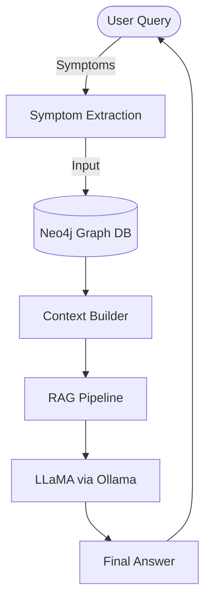

# 🩺 Healthcare Graph-RAG Chatbot  

An AI-powered **healthcare assistant** that uses a **Neo4j Knowledge Graph** + **RAG (Retrieval-Augmented Generation)** + **LLMs (LLaMA via Ollama)** to answer medical queries.  

⚠️ **Disclaimer**: This chatbot is **not a replacement for professional medical advice**. Always consult a qualified healthcare professional for medical concerns.  

---

## 🚀 Features
- **Conversational Chatbot**: Ask how you’re feeling, and the bot analyzes your symptoms.  
- **Knowledge Graph Powered**: Symptoms, diseases, cures, medicines, and precautions are stored in Neo4j.  
- **RAG Pipeline**: Queries fetch relevant knowledge graph data and inject it into the LLM context.  
- **Custom Instructions**: Behavior is guided by an external `instructions.txt` file.  

---

## 🛠️ Tech Stack & Libraries

| Area | Libraries / Packages |
|------|---------------------|
| **Python Standard Libraries** | `pathlib`, `typing`, `logging`, `requests` |
| **Graph Database** | `neo4j` Python driver |
| **LLM Integration** | Ollama REST API (`requests`) |
| **Project Modules** | `config`, `graph_connector` |

---

## 📂 Project Structure

```bash
healthcare-graph-rag/
│
├── app/
│   ├── graph_connector.py      # Handles Neo4j queries & builds context
│   ├── llm_agent.py            # Interactive chatbot with symptom extraction and Ollama integration
│   ├── instructions.txt        # System prompt for LLM
│   └── ...
│
├── data/
│   ├── diseases.json           # Example dataset with cures, medicines, precautions
│   ├── symptoms.json
│   └── ...
│
├── README.md                   # This file
└── requirements.txt            # Python dependencies
```

---

## ⚙️ Setup & Installation

### 1. Clone Repository
```bash
git clone https://github.com/SameerSingh2901/AI-Healthcare-Chatbot.git
cd AI-Healthcare-Chatbot
```

### 2. Create Virtual Environment
```bash
python3 -m venv venv
source venv/bin/activate   # macOS/Linux
venv\Scripts\activate     # Windows
```

### 3. Install Dependencies
```bash
pip install -r requirements.txt
```

Key dependencies:
- `neo4j`
- `requests`

### 4. Setup Neo4j
- Install [Neo4j Desktop](https://neo4j.com/download/) or run via Docker.  
- Create a database and note:
  - `NEO4J_URI`
  - `NEO4J_USER`
  - `NEO4J_PASSWORD`
- Update these in `config.py`.

### 5. Install & Run Ollama
- Install [Ollama](https://ollama.ai/download)  
- Pull the LLaMA model:
```bash
ollama pull llama3.1:latest
```

---

## 🧠 How It Works

### 🔹 Pipeline
1. **User Input**: “I have fever and cough.”  
2. **Symptom Extraction**: Symptoms mapped to graph nodes.  
3. **Neo4j Query**: Finds diseases linked to those symptoms.  
4. **Context Builder**: Formats disease info (description, cures, medicines, precautions).  
5. **RAG**: Injects context into the LLM prompt.  
6. **LLM Reasoning**: LLaMA answers user queries using only graph context.  

### 🔹 Example Conversation
```text
User: I have fever and cough.
Assistant:
Possible Diseases:
- Flu
- Pneumonia

Next Steps:
- Stay hydrated, rest
- Consider paracetamol for fever
- Consult a doctor if symptoms persist

⚠️ Disclaimer: I am not a doctor. Please consult a healthcare professional.
```

---

## 🖼️ Architecture Diagram (Mermaid)



---

## 🔧 Skills Showcased for Resume/Portfolio
- ✅ Retrieval-Augmented Generation (RAG) with Neo4j context  
- ✅ LLaMA model deployment via Ollama  
- ✅ Python best practices (modular code, OOP, configs)  
- ✅ Prompt engineering with instruction-tuning  

---

## 📌 Next Steps / Future Improvements
- Add **NER-based Symptom Extraction** (spaCy, transformers).  
- Expand dataset with real medical ontologies (e.g., SNOMED CT).  
- Build a **frontend (React/Streamlit)** for patient-like interaction.  
- Add **evaluation metrics** for chatbot responses.  

---

## ⚠️ Disclaimer
This project is for **educational purposes only**.  
It is **not a substitute for professional medical advice, diagnosis, or treatment**.  
Always consult a licensed healthcare provider.
